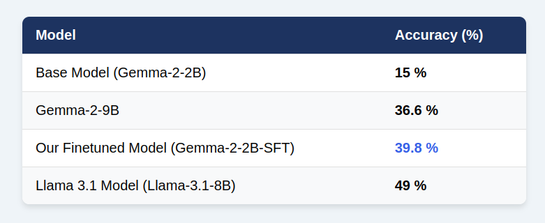

# Gemma 2 Math Finetune

## Dataset:

MathInstruct:\
https://huggingface.co/datasets/TIGER-Lab/MathInstruct

## Base Model:

Gemma2 2b Instruct by Unsloth:\
https://huggingface.co/unsloth/gemma-2b-it-bnb-4bit

## Loss Curve:

## Evaluation with Llama 70b:

